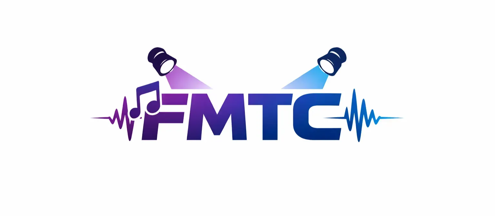
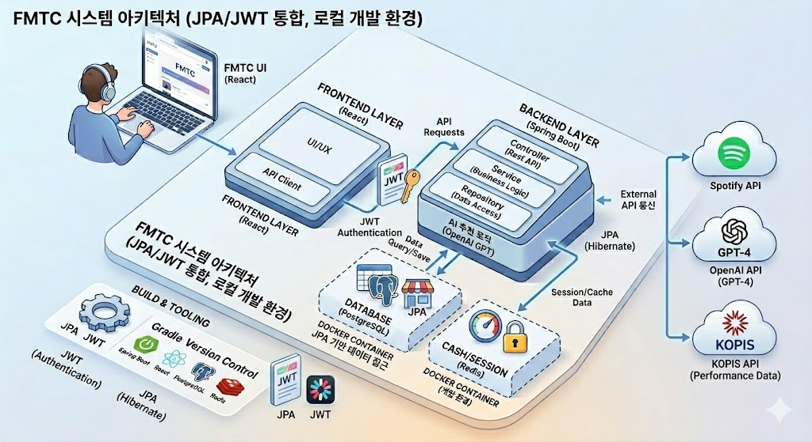
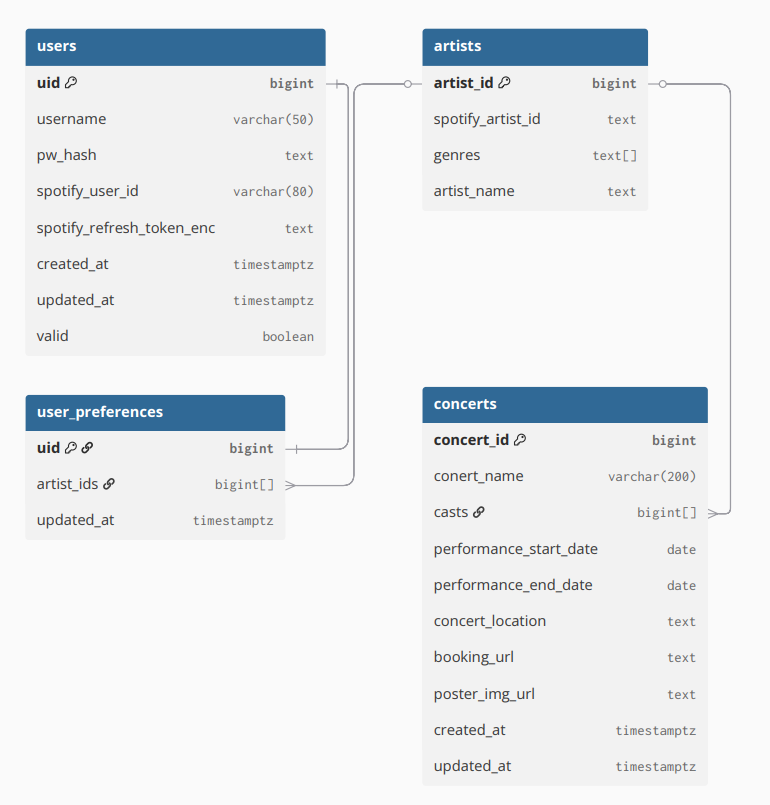
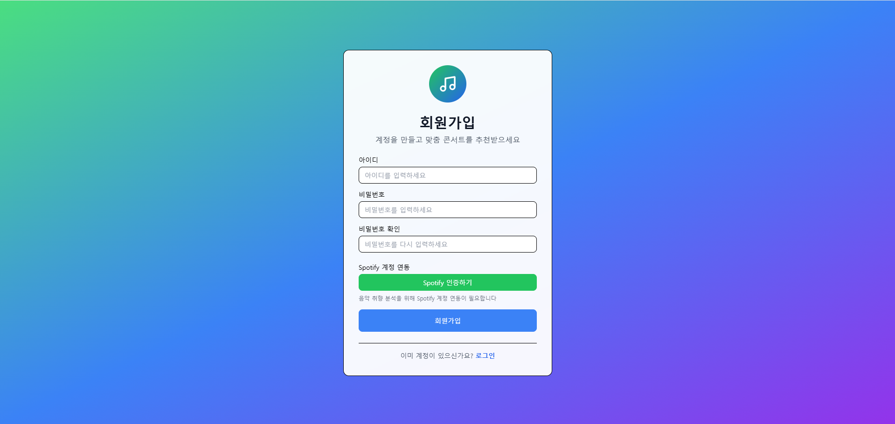
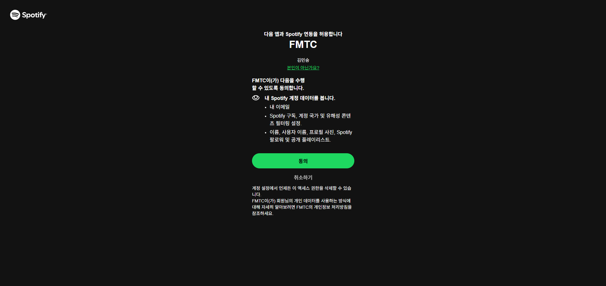
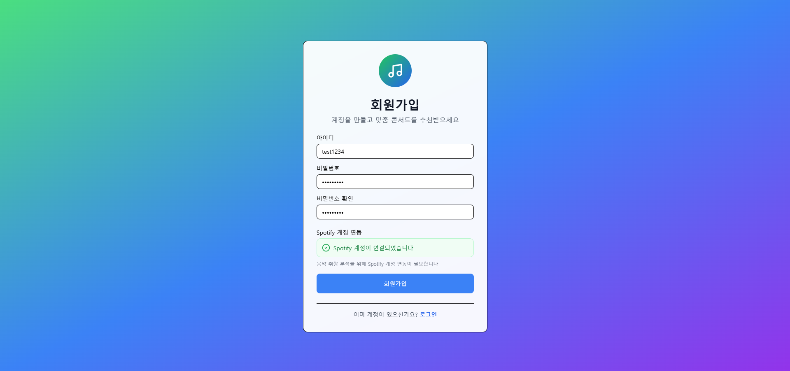
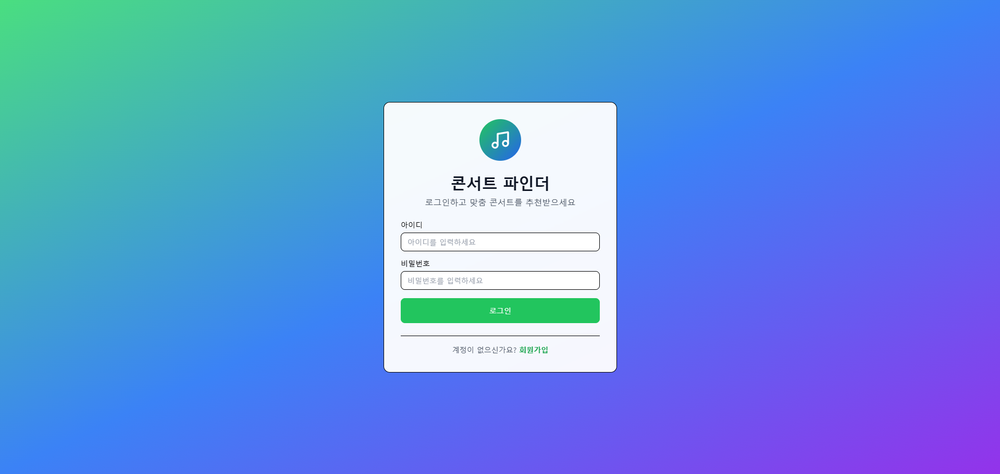
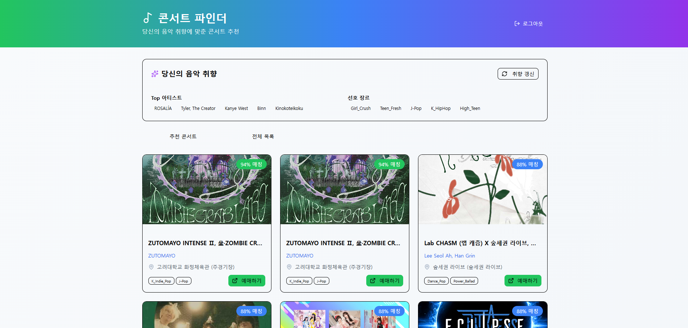
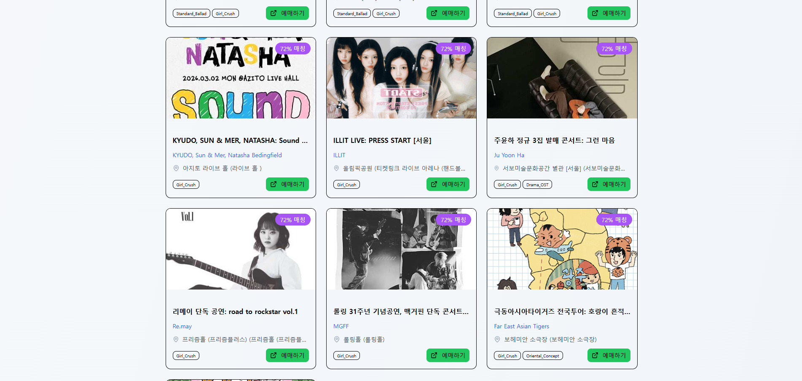

### FMTC - 음악 취향 기반 콘서트 매칭 서비스

  <h1>FMTC - 음악에서 공연까지</h1>
  
 Find Music To Concert

  
   
  <b>"당신의 음악 취향이 무대 위 공연이 되는 순간"</b>
   
  Spotify 분석과 AI 추천을 결합한 맞춤형 공연 큐레이션 서비스

---

# 📑 목차
1. [프로젝트 개요](#1-프로젝트-개요)
2. [기술 스택](#2-기술-스택)
3. [시스템 아키텍처](#3-시스템-아키텍처)
4. [ERD](#4-erd)
5. [주요 기능](#5-주요-기능)

---

# 1. 프로젝트 개요

## 🗓️ 개발 기간
**2025.12.30 - 2026.03.01**

## 👥 팀원 소개
| **김민제** |               **김민승**                |                **임한섭**                 |
| :---: |:------------------------------------:|:--------------------------------------:|
| [@Kovalt03](https://github.com/Kovalt03) | [@ebo-uf](https://github.com/ebo-uf) | [@h4vrut4](https://github.com/h4vrut4) |
| **Backend / Lead** |             **Backend**              |              **Backend**               |

## 🎯 프로젝트 소개
FMTC는 사용자의 **Spotify** 청취 기록을 분석하여 개인의 음악적 취향을 파악하고, 이를 바탕으로 **KOPIS**의 방대한 공연 데이터 중 가장 적합한 공연을 **Perplexity AI**를 통해 추천해주는 서비스입니다.

### 프로젝트 배경
기존의 콘서트는 광고를 통해서 접하거나 직접 검색을 통해서 찾아봐야했다. 내가 좋아하는 가수일지라도 해당 콘서트를 직접 검색하거나 찾아보지 않는다면 콘서트를 하는지 알 수 조차 없어 콘서트를 놓치는 경우가 많다. 또한, 인지도가 적은 공연의 경우 알려지기 어렵고 홍보하기도 애매한 경우가 많다.
이러한 문제들을 해결해보고자 이 프로젝트를 진행하게 되었다.
### 문제점 해결

- **콘서트 정보를 알기 어려움:** 내가 좋아하는 가수나 좋아할 만한 공연을 따로 찾아보지 않아도 알 수 있음.
- **인지도가 낮은 공연의 활성화:** 인지도가 낮은 공연도 사람들의 관심사에 맞게 추천하여 접근성을 높임.
- **AI 기반 콘서트 정보 분석:** 기존 Kopis에서 제공하는 제한적인 정보들을 넘어 AI를 통해서 더 다양한 정보들을 추출해서 사용함.

### 🚀 프로젝트 목표
1. Spotify API와 AI를 활용해 사용자의 음악 취향을 분석한다.
2. Kopis에서 제공하는 콘서트 정보들을 추출하고 AI를 활용해 부족한 정보들을 채운다.
3. 추출된 정보들을 기반으로 추천 알고리즘을 제작하여 사용자에게 콘서트를 추천해준다.

---

# 2. 기술 스택

## 🎨 Frontend & ⚙️ Backend
| 구분 | 기술 스택 |
| :--- | :--- |
| **Languages** |   |
| **Frameworks** |   |
| **Auth & Security** |  |
| **Databases** |   |

## 🌐 Connectivity & AI
| API |                                                   로고                                                   | 설명                                   |
| :--- |:------------------------------------------------------------------------------------------------------:|:-------------------------------------|
| **Spotify** |  | OAuth 기반 로그인, 사용자 음악 취향, 아티스트 데이터 추출 |
| **KOPIS** |        | 전국 공연 시설 및 예매 정보 연동                  |
| **AI** |   | 가수의 장르 데이터 및 콘서트 참가 인원 정보 추출         |

## 🛠️ 협업 툴
 

---

# 3. 시스템 아키텍처

  

---

# 4. ERD

  

---

# 5. 주요 기능

## 🔐 회원가입 | 로그인
### 회원가입
- **Spotify 연동 가입:** 간편 로그인 후 사용자의 선호 장르와 아티스트 정보를 자동으로 동기화합니다.
- **Spotify API 토큰:** Spotify API를 사용하기 위해서 필요한 토큰들을 암호화해서 저장합니다.
- **보안:** 회원가입 요청이 왔을 때 Redis를 활용해서 spotify 인증이 유효한지 유효성 검사를 합니다.

  

  

  

### 로그인
- **JWT:** JWT Token을 이용해 세션을 유지합니다.
- 아이디 | 비밀번호 입력 후 로그인 시 공연 추천 페이지로 이동

  

---

## 🎭 맞춤형 공연 추천
- **취향 분석:** 사용자의 Spotify의 top Artist 리스트를 가져오고 AI를 통해 해당 가수의 장르/분위기를 추출해 사용자의 선호 장르(취향)을 갱신합니다.
- **취향 기반 콘서트 추천:** 사용자의 선호 장르를 기반으로 KOPIS의 공연들을 취향 분석 알고리즘을 통해 매칭합니다.
- **실시간 데이터:** 현재 진행 중이거나 예정된 공연 정보를 카테고리별로 확인할 수 있습니다.

  
  

---

## 🗄️ KOPIS 공연 데이터 동기화
- **실시간 데이터 동기화:** KOPIS에서 공연 정보를 새로 올리거나 기존 데이터를 업데이트하기 때문에 특정 시간마다 KOPIS에서 공연 정보를 업데이트 받습니다.
- **공연의 캐스팅 목록 추출:** AI를 활용해서 공연의 출연진들을 추출하고 출연진들의 spotify_artist link가 있다면 매칭시키고 장르를 입력합니다.

